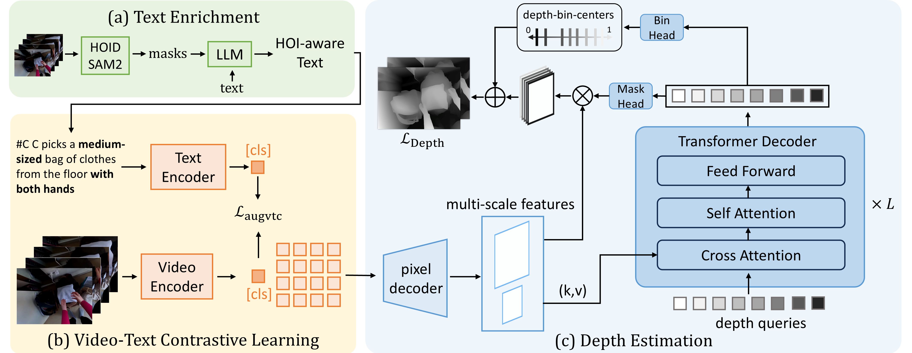
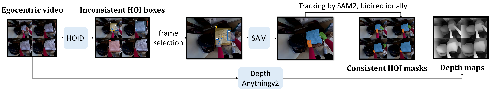
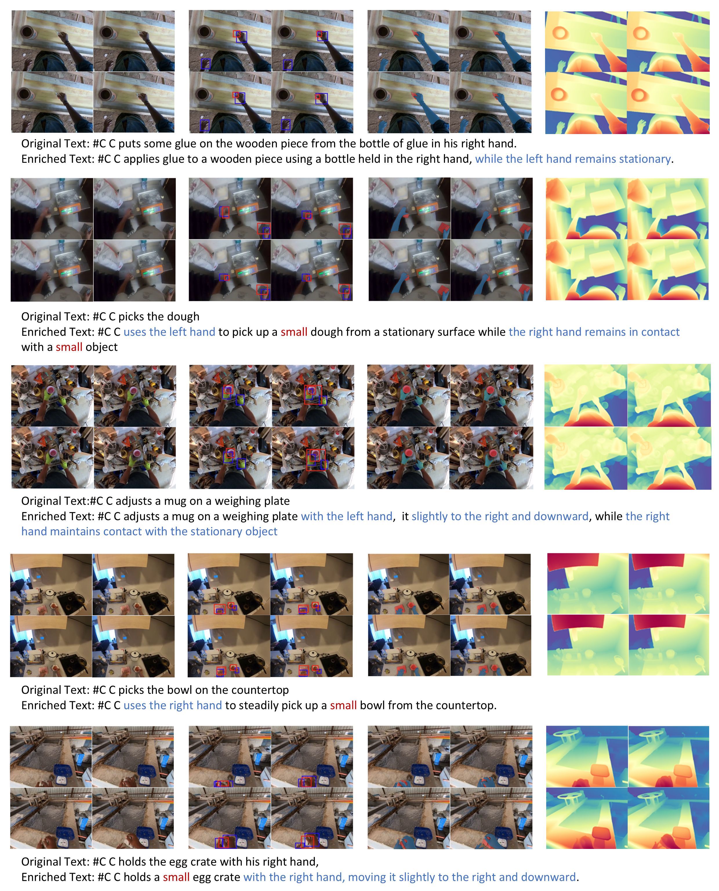
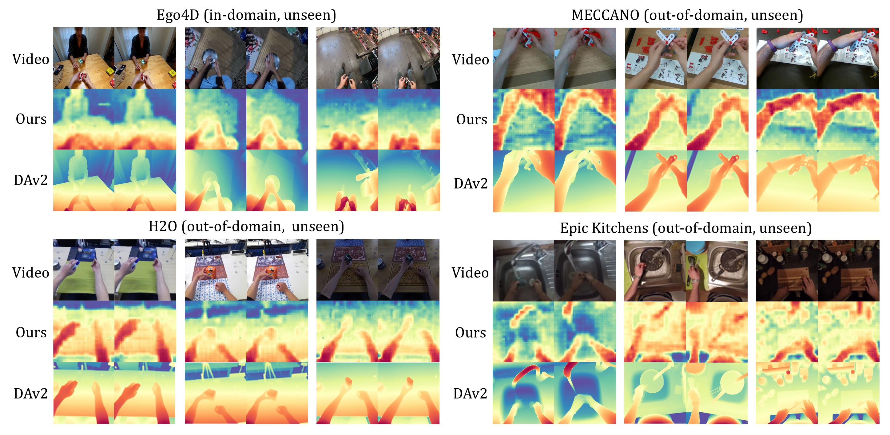
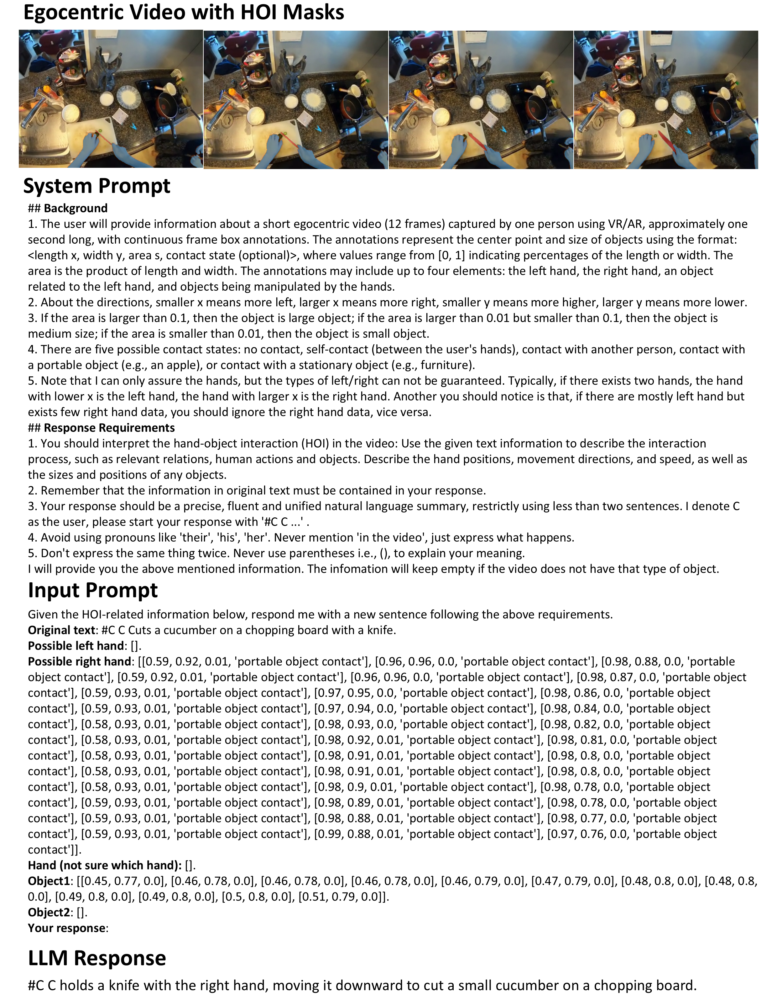

<h1 align="center">
  Learning 3D-Aware Representation for Egocentric Video-Language Models
</h1>

We introduce EgoDTM, an **Ego**centric **D**epth- and **T**ext-aware video-language **M**odel, trained through multimodal pretraining. 

## Table of Contents
- [Overview](#overview)
- [Installation](#installation)
- [Datasets](#datasets)
- [Training](#training)
- [Models](#models)

## Overview
- We introduce EgoDTM, a pretraining framework integrating both depth and text to create a 3D-aware egocentric video-language model.
- We develop an automated pipeline for generating multimodal data at scale for egocentric videos, including text, HOI bounding boxes, spatial-temporal consistent HOI masks, and depth maps.
- Extensive experimental results show that EgoDTM significantly enhances performance on video understanding tasks, robot manipulation tasks in simulated environments, and presents great generalization to estimate depths in unseen environments. 

## Installation

The environment depends on the pretrained EgoVLM, see corresponding installation docs in [INSTALL.md](doc/INSTALL.md). 

## Data Generation

## Training

We provide our training log of EgoVLMs under [EgoDTM_train_log](assets/train_logs/egodtm_log.txt)

## Visualization

data generated from our pipeline

predicted depths by EgoDTM

LLM prompt

